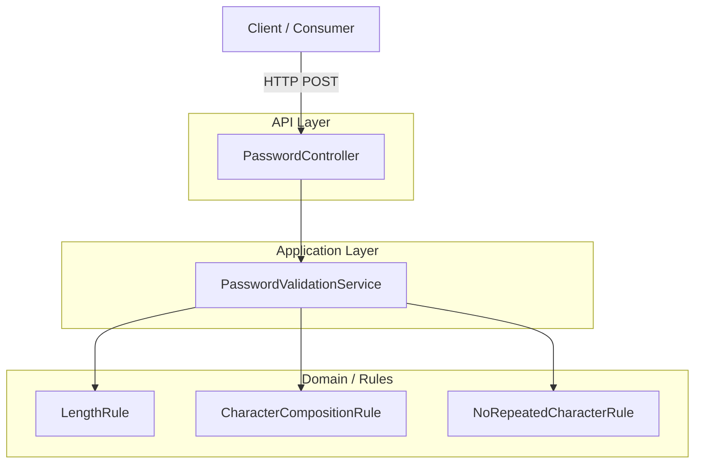
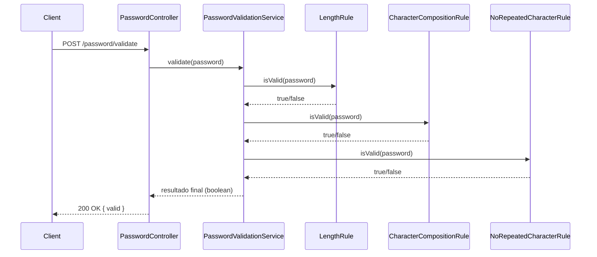

# API de Validação de Senha 

<!-- TOC -->

- [API de Validação de Senha](#api-de-validação-de-senha)
  - [Visão Geral](#visão-geral)
  - [Requisitos de Validação](#requisitos-de-validação)
  - [Tecnologias adotadas](#tecnologias-adotadas)
  - [Como executar o projeto](#como-executar-o-projeto)
  - [Estrutura do projeto e responsabilidades](#estrutura-do-projeto-e-responsabilidades)
    - [Benefícios desse design](#benefícios-desse-design)
  - [Arquitetura](#arquitetura)
  - [Diagrama de Sequência (Fluxo de Validação)](#diagrama-de-sequência-fluxo-de-validação)
  - [Princípios Aplicados e padrões aplicados](#princípios-aplicados-e-padrões-aplicados)
  - [Razões técnicas por trás de decisões importantes](#razões-técnicas-por-trás-de-decisões-importantes)
  - [Testes](#testes)
  - [Segurança e privacidade (decisões e recomendações)](#segurança-e-privacidade-decisões-e-recomendações)
  - [Alternativas e possibilidades arquiteturais](#alternativas-e-possibilidades-arquiteturais)
  - [Observações sobre a decisão de retorno (200 + {valid: false} vs 4xx)](#observações-sobre-a-decisão-de-retorno-200--valid-false-vs-4xx)

<!-- TOC -->

## Visão Geral

Esta aplicação expõe uma API REST para validar se uma senha atende a critérios de segurança pré-definidos. O foco da solução é clean code, SOLID, baixo acoplamento, testabilidade, segurança e extensibilidade.

A API não armazena nem loga senhas em texto puro. O objetivo do README é documentar decisões de arquitetura, segurança, trade-offs e melhorias possíveis.


## Requisitos de Validação

Uma senha é considerada válida quando:

- Possui **9 ou mais caracteres**
- Contém **ao menos 1 dígito** (0-9)
- Contém **ao menos 1 letra minúscula** (a-z)
- Contém **ao menos 1 letra maiúscula** (A-Z)
- Contém **ao menos 1 caractere especial**: `!@#$%^&*()-+`
- **Não possui caracteres repetidos** (comparação case-insensitive)
- **Não contém espaços em branco**

> [!NOTE] 
> Esses requisitos norteiam as implementações das regras (`LengthRule`, `CharacterCompositionRule`, `NoRepeatedCharacterRule`).

---
## Tecnologias adotadas

Resumo das principais tecnologias, bibliotecas e ferramentas utilizadas no projeto:

- Java 17 — versão alvo para compilação e execução.
- Spring Boot 3.2.1 — framework para construção da API REST e gerenciamento de componentes.
- Maven — ferramenta de build e gerenciamento de dependências.
- JUnit 5 — framework de testes unitários e de integração.
- MockMvc (Spring Test) — testes de integração do controller sem subir servidor completo.

> [!NOTE] 
> Dependências e versões específicas estão declaradas no `pom.xml`.

## Como executar o projeto

Passo a passo mínimo para executar o projeto localmente (assumindo um ambiente com Java 17 e Maven instalados):

1. Clonar o repositório / abrir a pasta do projeto:

```bash
git clone <repo-url>
cd validator-password
```

2. Rodar a suíte de testes (unitários e de integração):

```bash
mvn -DskipTests=false test
```

3. Iniciar a aplicação localmente:

```bash
mvn spring-boot:run
```

- Por padrão, a aplicação inicia na porta 8080. Para testar manualmente use o curl ou uma ferramenta como Postman/Insomnia.
```bash
curl -s -X POST http://localhost:8080/api/password/validate -H "Content-Type: application/json" \
  -d '{"password":"AbTp9!fok"}'
```


- Para alterar a porta, exporte a variável `SERVER_PORT` ou adicione `--server.port=XXXX` ao comando `spring-boot:run`, por exemplo:

```bash
mvn spring-boot:run -Dspring-boot.run.arguments="--server.port=9090"
```
---

## Estrutura do projeto e responsabilidades

- `org.iti.password.rules` — contém implementações de regras individuais (cada regra implementa a interface `PasswordRule`):
  - `LengthRule` — valida comprimento mínimo (>=9)
  - `CharacterCompositionRule` — valida dígito, minúscula, maiúscula, caractere especial e ausência de whitespace
  - `NoRepeatedCharacterRule` — valida ausência de caracteres repetidos (case-insensitive)
- `org.iti.password.service.PasswordValidationService` — recebe a lista de `PasswordRule` via injeção e aplica todas as regras (todas devem passar)
- `org.iti.password.controller.PasswordController` — endpoint REST que delega ao `PasswordValidationService`
- `org.iti.password.dto` — objetos de request/response simples para I/O JSON

> [!TIP]  
> Cada responsabilidade é separada — regras são componentes independentes, a service compõe-as e o controller expõe o serviço.

### Benefícios desse design

- **Extensibilidade**: novas regras podem ser adicionadas sem alterar `PasswordValidationService` (apenas registrar o novo componente)
- **Testabilidade**: regras testáveis isoladamente
- **Baixo acoplamento**: `PasswordValidationService` apenas conhece a interface `PasswordRule`

---

## Arquitetura
Diagrama de Componentes 



**Fluxo:**

1. O cliente envia a senha via requisição HTTP

2. O Controller delega a validação para o Service

3. O Service executa todas as regras de forma composta

4. O resultado final (válido ou inválido) é retornado


> [!NOTE] 
Atualmente o endpoint retorna 200 OK com um body ``{ "valid": true/false }`` para senhas válidas/inválidas. Essa decisão facilita consumo simples, mas alternativas (usar 4xx) também são discutidas abaixo.

---

## Diagrama de Sequência (Fluxo de Validação)




> [!NOTE] 
> As regras são executadas de forma independente
> 
> O fluxo pode ser interrompido caso alguma regra falhe
>
>Novas regras podem ser adicionadas sem alterar o fluxo principal


## Princípios Aplicados e padrões aplicados

**SRP (Single Responsibility Principle)**: cada regra de senha é um validator independente

**OCP (Open/Closed Principle)**: novas regras podem ser adicionadas sem alterar as existentes

**DIP (Dependency Inversion Principle)**: Service depende de abstrações

**Strategy**: Utilizado para encapsular cada regra de validação de senha, permitindo adicionar novas regras sem alterar o código existente. (PasswordRule é implementado por Classes de Rules)

**Chain of Responsibility:** Utilizado para executar as regras de validação de forma sequencial, permitindo interromper o processamento na primeira falha. (PasswordValidatorService)


## Razões técnicas por trás de decisões importantes

1) **Regras como componentes injetáveis**
- **Por quê**: permite usar a inversão de controle do Spring para montar a lista de regras automaticamente. Evita acoplamento à implementação concreta, facilitando testes e substituições.

1) **Todas as regras devem passar**
- **Por quê**: políticas de senha normalmente impõem que todas as restrições sejam respeitadas; o serviço chama ``rules.stream().allMatch(...)``.
- **Alternativa:** retornar mensagens por regra falhada (útil para UX). Poderíamos retornar um DTO com as falhas por regra para orientar o usuário.

1) **Comparação de repetição case-insensitive**
- **Por quê:** usuários frequentemente confundem 'a' e 'A' como diferente; para evitar ambiguidade, optou-se por tratar como repetição (mais restritivo).
- **Trade-off:** restrito para senhas que poderiam ser aceitáveis se case-sensitive. Decisão conservadora para o processo seletivo.

1) **Evitar armazenar a senha**
- **Por quê:** segurança. O sistema não armazena nem registra senhas. Retornamos apenas um boolean no corpo da resposta.

1) **Resposta 200 OK com {"valid": false} em vez de 4xx**
- **Por quê**: separa erro de validação de erro de comunicação. O endpoint foi pensado como verificador (status 200 + payload descreve resultado). Em APIs públicas, também é aceitável usar 400 para indicar dados inválidos. Escolha feita por simplicidade do consumidor.

---

## Testes

- Unit tests por regra:
  - `CharacterCompositionRuleTest` — testa presença/ausência de dígito, minúscula, maiúscula, caractere especial, whitespace e caracteres especiais não permitidos.
  - `LengthRuleTest` — testa >=9, <9 e null.
  - `NoRepeatedCharacterRuleTest` — testa repetição exata, repetição por case, null e string vazia.
- `PasswordValidationServiceTest` — compõe as regras e testa cenários end-to-end no nível de service (sem subir o contexto Spring).
- `PasswordControllerIntegrationTest` — usa `@SpringBootTest` + `MockMvc` para testar o endpoint real com o contexto do Spring.
  

Como rodar os testes localmente (Maven):

```bash
mvn test
```

Ou para um relatório mais detalhado:

```bash
mvn -DskipTests=false test
```

---

## Segurança e privacidade (decisões e recomendações)

1) **Nunca armazenar a senha em texto puro**
- **Hoje:** a aplicação não persiste senhas.
- **Produção:** se for necessário armazenar (por exemplo para autenticação real), usar hashing adaptativo (BCrypt, Argon2)
  
2) **Transporte seguro**
- Exigir HTTPS/TLS. Nunca permitir tráfego em texto simples em produção.

3) **Logging**
- Nunca logar senhas. Se for imprescindível coletar métricas, utilizar hash da senha
  
4) **Rate limiting / brute-force**
- API pública deve aplicar rate limiting por IP/cliente e proteção contra força bruta.

5) **Mensagens de erro**
- Evitar dar pistas detalhadas (ex.: "faltando maiúscula") em endpoints sensíveis — exibí-las apenas em UIs autenticadas ou se for necessário para usabilidade. Para flows de força bruta, mensagens muito detalhadas podem ajudar um atacante.

6) **Sanitização**
- Proteger entry points contra payload malformado e limitar o tamanho do body para mitigar DoS (por exemplo, recusar strings de tamanho absurdo antes do processamento).

---

## Alternativas e possibilidades arquiteturais 

1) **Regras injetáveis + service aggregator (Strategy/Chain-of-responsibility simplificado)**
- Prós: simples, testável, extensível
- Contras: regras são avaliadas todas; não há prioridade customizável além do allMatch

2) **Retornar diagnóstico por regra (DTO com falhas por regra)**
- Prós: melhor UX — cliente sabe o que corrigir
- Contras: pode vazar informação para atacantes. Balancear com rate-limiting e proteção.

3) **Validadores baseados em regex vs código imperativo**
- Regex: desempenho (quando simples). Difícil de manter regras complexas 
- Código imperativo: mais claro e fácil de testar; escolhido aqui por legibilidade e por regra de repetição/normalização.

4) **Tratar política de senhas dinamicamente**
- Em produção, políticas podem ser configuráveis via DB ou config server; implementar uma camada de Policy Provider permite gerenciar regras sem deploy.

5) **Observabilidade e métricas**
- Expor métricas (Prometheus): número de validações, taxa de falhas por tipo (cautelosamente, sem expor conteúdo sensível)

---

## Observações sobre a decisão de retorno (200 + {valid: false} vs 4xx)

- O projeto atual retorna 200/OK e um corpo JSON com o booleano `valid`. Essa escolha é orientada por simplicidade e por tratar o endpoint como "verificador" e não como erro de requisição.
- Se preferir usar códigos semânticos HTTP: retornar 400/Bad Request para payloads inválidos (por exemplo, corpo ausente ou tipo errado) e manter 200 para uma verificação realizada com sucesso (mesmo que `valid:false`). Nunca usar 5xx para validação normal.

---
